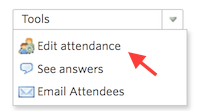
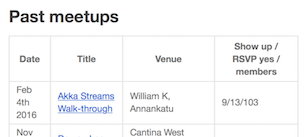

# Organizer checklist

## Before meeting

...tbd...

## During meeting

...tbd...

- Make notes on who actually showed up

- Would be nice to get pictures of attendees, right after the meetup. Preferably on some stairs, to get a common theme to the pictures.

Upload the picture to `meetup.com`. The meetup mobile clients have nice tools for this.

- When departing, please suggest that attendees would give feedback either directly, or via the meetup.com starring/commenting feature.

Note: The next meeting place, time and agenda are normally not known at the end of the meeting. Once there is a backlog of suggested agendas, this may change. However, meetings are on the first Thursday of a month, so a small group could remain talking and informally agreeing on who's hosting the next one, where and in which month.

Ideally, there would be activity on the GitHub repo / Gitter / meetup.com in between the meetups as well.

| Idea |
|
| We could have "business cards" for the meetup - listing  the repo, meetup, gitter URLs and the essentials (like first Thu of a month, 18-19:30) for visitors.

## After meeting

- Fill in attendance in `meetup.com` to follow, who actually showed up and who didn't:
  - go to the particular meeting's page
  - above the attendees list there's a small `Tools` menu

  - mark the ones who weren't there as "no show"

Note: because of guests, the number of attendees might not match with reality. That's quite fine. We keep the real numbers in the main `README.md` in the GitHub repo (see next stage).

- Fill in the meeting to GitHub repo's main README:

Add the last one topmost.

- Commit any code done during the meetup to the repo, or make a short 

